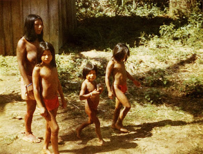

Es el único territorio en América del Sur continental que ha elegido la integración completa en un país europeo.

Consiste de dos triángulos formados por la división del paño en dos mitades por su diagonal descendente desde el lado del mástil, siendo verde el superior y amarillo el inferior. Al centro se ubica una estrella roja, cuyo diámetro es equivalente a la tercera parte del ancho de la bandera.

**¿A qué se debe su nombre?**

“Tierra de aguas.” Este es el significado de Guyana, nombre de un país de Sudamérica cuya frontera sur se encuentra a apenas 130 kilómetros (80 millas) al norte del ecuador. La designación resulta muy adecuada, pues más de cuarenta ríos e innumerables afluentes cruzan los bosques y selvas que forman la mayor parte de sus 215.000 kilómetros cuadrados [83.000 millas cuadradas. Algunos ríos trazan los límites con los países vecinos (Brasil, Surinam y Venezuela), mientras que otros dan acceso al interior, donde hay pueblos y haciendas dispersos a lo largo de sus riberas.

**Límites**

Se ubica en la costa norte de América del Sur, en la región de Las Guayanas, entre Brasil y Surinam limitando al norte con el océano Atlántico. Su capital y ciudad más poblada es Cayena.

**Descripción del País**

De oeste a este, los cuatro ríos principales son el Esequibo, el Demerara, el Berbice y el Courantyne. El de más longitud, el Esequibo, mide 1.000 kilómetros (630 millas) de largo y 30 (20 millas) de ancho en su desembocadura, y tiene más de trescientas sesenta y cinco islas. Una de estas, Fort Island, fue sede del gobierno en la época colonial holandesa. Estos grandes ríos nacen en las montañas del interior, al sur del país, y fluyen hacia el norte antes de serpentear por la estrecha llanura costera y morir en el Atlántico. En el trayecto, sus aguas se precipitan por algunas de las cataratas más impresionantes del mundo, como las de Kaieteur, en las que el río Potaro un tributario del Esequibo de 120 metros (400 pies de anchura— salva 226 metros (741 pies) en el salto inicial.
Sus numerosas atracciones naturales hacen de Guyana un paraíso para los amantes de la naturaleza. En sus aguas habitan nutrias gigantes, caimanes negros y pirarucús, también llamados arapaimas, que figuran entre los peces de agua dulce más grandes que se conocen. Estos gigantes carnívoros que pueden respirar en el aire llegan a medir tres metros \[10 pies] de largo y pesar 220 kilos \[485 libras]. Los jaguares merodean en la espesura, y los monos aulladores gritan en las ramas de los árboles, que comparten con más de setecientas especies de aves, entre ellas las águilas harpías y los espectacularmente coloridos guacamayos y tucanes.
La población de Guyana es de unos 770.000 habitantes y se compone de indios orientales (cuyos antepasados vinieron de la India a trabajar bajo contrato); negros (descendientes de esclavos africanos); indígenas (arauacos, caribes, wapisanas y warraus), así como mezclas interraciales. Aunque se habla criollo en todo el país, el idioma oficial es el inglés, lo que hace de Guyana la única nación anglohablante de Sudamérica.

La Guayana Francesa fue habitada originalmente por tribus de indígenas caribes y arahuacos indígenas de Venezuela principalmente, y también por pequeños grupos de galibi, emerillón, palikour, waiampi y wayana.

Francia colonizó el territorio en el siglo XVII; esta colonización se realizó cuando Luis XIV envió miles de colonos a Guayana. Los colonos fueron seducidos para realizar esta empresa con historias de muchísimo oro y fortunas fáciles de hacer. Pero, por el contrario, se encontraron con una tierra llena de nativos hostiles y enfermedades tropicales. Un año y medio después, solo unos pocos cientos sobrevivieron.

**Animal emblemático de Guyana**

