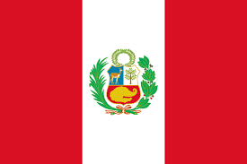

Perú está ubicado en la parte occidental de América del Sur y comparte sus fronteras con Ecuador, Colombia, Brasil, Bolivia y Chile. En su vasto territorio, de más de 1.2 millones de km², abarca tres regiones: Costa, Sierra y Selva.

Perú es un país de Sudamérica que abarca una sección del bosque del Amazonas y Machu Picchu, una antigua ciudad inca en las alturas de los Andes. La región en torno a Machu Picchu, incluido el Valle Sagrado, el Camino del Inca y la ciudad colonial de Cuzco, es rica en sitios arqueológicos. En la costa árida del Pacífico de Perú se encuentra Lima, la capital, con un centro colonial preservado e importantes colecciones de arte precolombino.

La historia de Perú se remonta a unos cuantos años atrás, con la presencia cazadores-recolectores nómadas que aparecieron en el territorio actual del país mucho antes incluso que ahí se estableciese la civilización de Norte Chico, una de las seis más antiguas del mundo.

El territorio de la República se divide en regiones, departamentos, provincias y distritos, en cuyas circunscripciones se ejerce el gobierno unitario de manera descentralizada y desconcentrada.