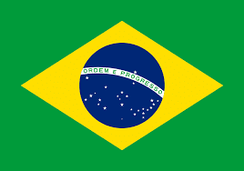
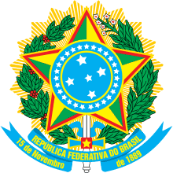
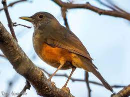
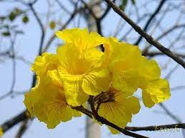
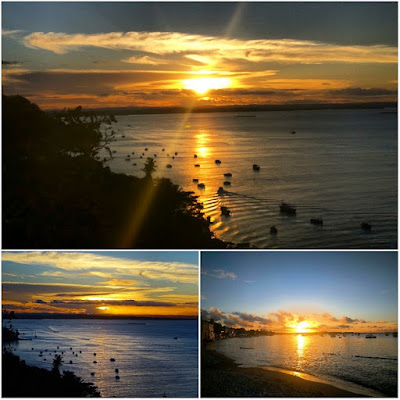

República Federativa Do Brasil

_**Limita con todos los países de América del Sur exceptuando a Chile y Ecuador**_ 

_**Miembro de Mercosur**_ 

_**Nombre Oficial**: República Federativa del Brasil_ 

_**Capital**: Brasilia_ 

_**Ubicación**: América del Sur_

_**Límites**:_ _Al Norte con Guayana Francesa, Surinam, Guyana y Venezuela, al noroeste con Colombia, al oeste con Perú y Bolivia; al suroeste con Paraguay y Argentina y al sur con Uruguay. Tiene frontera con todos los países de América del Sur con excepción de Ecuador y Chile._

_**Superficie**: 8.511 965 km._

_Es el 5to país en extensión y en población del mundo_

_

**Presidente**: Jair Bolsonaro Tendencia

**Capital**: Brasilia

**Superficie**: 8.516 millones km²

**Población**: 212.6 millones (2020) 

**Moneda**: Real brasileño

**Idioma oficial**: Portugués

_

  

    Los pobladores originales de Brasil se dedicaban a la caza, la recolección y la agricultura. Los exploradores portugueses trajeron al país la religión católica, de modo que con el tiempo se construyeron muchas iglesias y capillas, algunas adornadas con elaboradas talladuras en madera recubierta de oro.

Entre mediados del siglo XVI y mediados del XIX fueron traídos en barco unos cuatro millones de esclavos africanos para trabajar en los cultivos. Estos trajeron consigo sus ritos, los cuales dieron nacimiento a religiones afrobrasileñas como la macumba y el culto candomblé. La influencia africana también se percibe en la música, el baile y la comida.

La feijoada, guiso tradicional brasileño, es una versión de un plato portugués hecha con frijoles negros y una combinación de carnes. Se acompaña con arroz y repollo. Durante los siglos XIX y XX llegaron al país millones de inmigrantes europeos (sobre todo de Alemania, España, Italia y Polonia), japoneses y de otros países.

> Brasil es un vasto país de Sudamérica que se extiende desde la Cuenca del Amazonas en el norte hasta los viñedos y las enormes cataratas del Iguazú en el sur. Río de Janeiro, simbolizado por su estatua de 38 m del Cristo Redentor sobre el cerro del Corcovado, es famoso por sus ajetreadas playas Copacabana e Ipanema, junto con su enorme y estridente festival del Carnaval, que cuenta con carros alegóricos, exuberantes disfraces y danza y música samba. 

 

  

  

  

El escudo de armas de Brasil fue creado, igual que la bandera, por el Decreto No. 34 del 19 de noviembre de 1889. La espada representa a la bondad; el escudo redondo central, de color azul, contiene la constelación de la Cruz del Sur, uno de los símbolos consagrados de Brasil. En torno a la esfera hay 20 estrellas de plata, representando los 20 Estados de Brasil (27 actualmente). El escudo redondo reposa sobre una gran estrella donde figuran los colores nacionales, el verde y el amarillo: esa estrella representa la unidad federativa del país.

  

Las dos plantas son: a la izquierda, el café y a la derecha, el tabaco, es decir, los dos principales productos de Brasil en 1889.

  

El fondo rayado de oro representa la alborada de la República. Se observa que forma una gran estrella de 20 puntas, simbolizando nuevamente los Estados del país. La fecha indicada en la cinta es la que corresponde a la proclamación de la República.

  

La leyenda “Estados Unidos do Brasil” ("Estados Unidos de Brasil") fue substituida en 1968 por “República Federativa do Brasil” ("República Federativa de Brasil"), según lo dispuesto por las leyes 5.389 del 22 de febrero, y 5.443 del 28 de mayo.

  

_**Animal Emblemático**_

Zorzal Colorado   

  

_**Flor Nacional**_ 

Ipé Amarillo 

 

                                 

  

Se le ha llamado “tierra de contrastes”, y con razón. Aunque Brasil es una nación principalmente tropical, abarca desde el clima subtropical del sur hasta el ecuatorial de la Amazonia. Su historia también está marcada por la diversidad. En el transcurso de los años, su extenso territorio 8.511.999 kilómetros cuadrados, con 7.400 kilómetros de costas ha acogido habitantes de múltiples culturas.

  

El 9 de marzo de 1500, Pedro Álvares Cabral partió desde Portugal con su flota. Aunque su intención era fundar una factoría en Calicut (India), antes de llegar a su destino arribó a las costas que hoy corresponden al estado brasileño de Bahía. Era el 23 de abril de 1500.

Algunos estudiosos opinan que los portugueses ya sabían de la existencia de estas tierras y que Cabral no recaló allí de forma accidental. En todo caso, parece que el único producto de interés que presentaban aquellas regiones era el palo brasil, árbol famoso por el tinte carmesí que proporciona. Aunque este producto ofrecía grandes posibilidades, eran más valiosas las especias de la India.

Por diez años, la corona portuguesa arrendó el nuevo país al lusitano Fernando de Noronha, quien explotó el palo brasil y pagó impuestos sobre sus ganancias. Pero había otras naciones europeas deseosas de acrecentar el comercio con el Nuevo Mundo, por lo que Noronha no pudo impedir la expansión del tráfico ilegal que realizaban los navegantes franceses, ingleses y españoles. Temerosos de perder Brasil, los portugueses iniciaron su colonización en 1532. El primer negocio rentable del territorio lo constituiría la producción de azúcar.

A partir del siglo XIX, millones de extranjeros afluyeron al país, desde puntos tan diversos como Alemania, España, Italia, Japón, el Líbano, Polonia, Siria y Suiza. Hoy Brasil es un buen lugar para vivir, con abundante vida natural y, por lo general, libre de catástrofes naturales. No padece guerras, sismos, erupciones volcánicas, ciclones ni maremotos. Así pues, ¿por qué no visita algunos de sus puntos de interés a fin de conocer mejor esta nación? Disfrutará de la misma hospitalidad y las mismas bellezas naturales que impresionaron a los portugueses hace quinientos años.

  

Posee playas impresionantes por su agua cristalina y sus aguas tropicales

  

  

_**Música**_

La samba es un género musical de raíces africanas surgido en Brasil, del cual deriva un tipo de danza. Es una de las principales manifestaciones de la cultura popular brasileña y un símbolo de la identidad nacional.

<iframe width="414" height="266" src="https://www.youtube.com/embed/7DNsBhfljO0" title="YouTube video player" frameborder="0" allow="accelerometer; autoplay; clipboard-write; encrypted-media; gyroscope; picture-in-picture" allowfullscreen></iframe>

Brasil también es considerado como un país que tiene muchos ritmos musicales, pero hoy hablaremos de la salsa, específicamente de Carlitos Marrón y su Salsa.

  

  
<iframe width="426" height="266" src="https://www.youtube.com/embed/bwKEVLRs8mw" title="YouTube video player" frameborder="0" allow="accelerometer; autoplay; clipboard-write; encrypted-media; gyroscope; picture-in-picture" allowfullscreen></iframe>
  

  

No podemos continuar sin hacer mención de uno de los mejores exponentes de la música Brasileña, como lo fue el cantante Roberto Carlos, oriundo de ese gran país. Le decían el Rey de la Música Latina. 

Nació en el estado de Espírito Santo, fue descubierto por el compositor y periodista Carlos Imperial. A los seis años de edad, el día de la fiesta de San Pedro (patrono de Cachoeiro de Itapemirim) fue atropellado por una locomotora de vapor y la pierna derecha le tuvo que ser amputada un poco debajo de la rodilla.

  

<iframe width="418" height="266" src="https://www.youtube.com/embed/oDoDHDCoxMk" title="YouTube video player" frameborder="0" allow="accelerometer; autoplay; clipboard-write; encrypted-media; gyroscope; picture-in-picture" allowfullscreen></iframe>

  

  

Género: Pop

Fue el autor de una célebre canción   que el mismo tituló: Lady Laura en honor a su madre fallecida en 2010 por problemas respiratorios, mientras el artista se encontraba de gira por los Estados Unidos.

  

  
<iframe width="410" height="266" src="https://www.youtube.com/embed/8sioAQVcaDQ" title="YouTube video player" frameborder="0" allow="accelerometer; autoplay; clipboard-write; encrypted-media; gyroscope; picture-in-picture" allowfullscreen></iframe>
  

  

Lady Laura

Tengo a veces deseos de ser

Nuevamente un chiquillo

Y en la hora que estoy afligido

Volverte a oír

De pedir que me abraces y lleves

De vuelta a casa

Que me cuentes un cuento bonito

Y me hagas dormir.

  

Muchas veces quisiera oirte

Hablando sonriendo:

Aprovecha tu tiempo

Tú eres aún un chiquillo

  

A pesar la distancia y el tiempo

No puedo olvidar

Tantas cosas que a veces de ti

Necesito escuchar.

  

Lady Laura, abrázame fuerte

Lady Laura, y cuéntame un cuento

Lady Laura, un beso otra vez

Lady Laura.

  

Lady Laura, abrázame fuerte

Lady Laura hazme dormir

Lady Laura, un beso otra vez

Lady Laura.

  

Tantas veces me siento perdido

Durante la noche

Con problemas y angustias

Que son de la gente mayor

Con la mano apretando

Mi hombro seguro dirías:

Ya verás que mañana las cosas

Te salen mejor.

  

Cuando era un niño

Y podía llorar en tus brazos

Y oír tanta cosa bonita

En mi aflicción

En momentos alegres

Sentado a tu lado reía

Y en mis horas difíciles

Dabas tu corazón.

  

Lady Laura, abrázame fuerte

Lady Laura,, y cuéntame un cuento

Lady Laura, y hazme dormir

Lady Laura.

  

Lady Laura, abrázame fuerte

Lady Laura llévame a casa

Lady Laura, y cuéntame un cuento

Lady Laura.

  

Tengo a veces deseos de ser

Nuevamente un chiquillo

El pequeño que tú todavía

Aún crees tener

Cuando a veces te abrazo y te beso

En silencio entendido

Tú me dices aquello

Que yo necesito saber.

  

Lady Laura, abrázame fuerte

Lady Laura, y cuéntame un cuento

Lady Laura, un beso otra vez

Lady Laura.

  

Lady Laura, abrázame fuerte

Lady Laura, y llévame a casa

Lady Laura, un beso otra vez

Lady Laura.

  

Lady Laura, Lady Laura, Lady, Lady, Lady, Lady, Lady Laura

Lady Laura, Lady Laura, Lady Laura.

  

Canción lanzada en 1978 por este gran cantante en honor a su madre que lo apoyó toda la vida en su carrera musical , ese año vendió más de un millón de copias del álbum donde se encontraba esa canción. La madre de Roberto Carlos murió a la edad de 96 años en Río de Janeiro por problemas respiratorios, él homenajeó a su madre cantándole esa canción en su funeral 

  

Estos fueron algunos de sus éxitos

  

“El cacharrito”, “Jesus Cristo”, “Un millón de amigos”, “Amada amante”, “Que será de ti”, “Propuesta”, “Canzone per te”, “Un gato en la oscuridad”, “Detalles”, “El progreso”, “Amigo”, “Lady Laura”, “Desahogo”, “No te apartes de mi”, “Amantes a la antigua”, “Cama y mesa”, “Emociones”, "Los Camioneros", “Cóncavo y convexo”, “Símbolo sexual”, “Desde el fondo de mi corazón”, “Apocalipsis”, “Nuestro amor”, “Piel Canela”, “Si el amor se va”, “Mis amores”, “Si me vas a olvidar”, “Amor sin límites”, “Negra”, “Mujer pequeña”,"Abre las ventanas al amor", "Namoradinha de un amigo meu", "Eu daria a minha vida", etc.