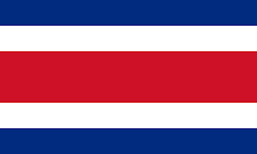
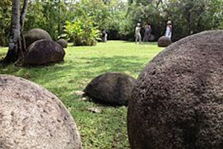
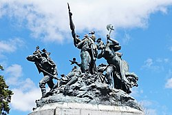
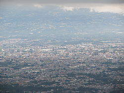
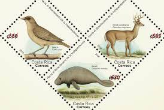
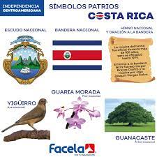
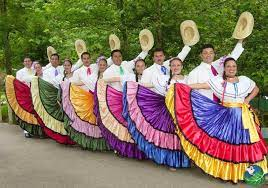
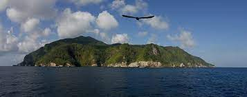
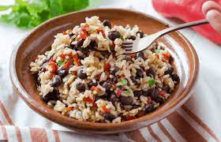
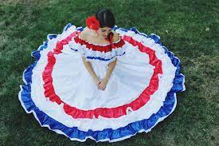

_**Bienvenidos a Costa Rica**_

En sus conversaciones usan la expresión “pura vida” cuando están de acuerdo con algo, o en lugar de decir “hola” y “adiós”.

  
**Bandera de Costa Rica** 

  

**_Descripción del País_**

Ubicación: América Central

Mide: 51.180 km²

Límites: Con Nicaragua al norte , al este con el Mar Caribe, Panamá  al sureste y el Océano Pacífico

Capital: San José

Idioma: Español

Gentilicio: Costarricense

  

    Hace 500 años, los españoles llegaron a esta región y la llamaron Costa Rica porque pensaban que encontrarían oro; sin embargo, su búsqueda fracasó. Hoy día no se conoce a este país por sus metales preciosos, pero sí por ser uno de los lugares con más variedad de animales y plantas en el mundo. 2 A los costarricenses los llaman ticos por la costumbre que tienen de añadir “-ico” al final de las palabras. Por ejemplo, en lugar de decir “un momento” dicen “un momentico”. En sus conversaciones usan la expresión “pura vida” cuando están de acuerdo con algo, o en lugar de decir “hola” y “adiós”. 3 Uno de los platos favoritos en Costa Rica es el “gallo pinto”. Este plato se prepara con frijoles, o alubias, y arroz. Primero se cocinan por separado y luego juntos con condimentos. El “gallo pinto” se puede servir para el desayuno, el almuerzo o la cena. Una bebida tradicional es el café chorreado, que se prepara utilizando un filtro de tela colgado de un soporte, normalmente de madera. ¿Lo sabía? En Costa Rica se han hallado cientos de esferas de piedra. La más grande mide 2,4 metros de diámetro (8 pies). Los investigadores piensan que algunas de ellas fueron talladas hace más de 1.400 años. Lo que nadie sabe es para qué las hicieron.

  

    El nombre Costa Rica para designar al territorio nacional apareció por primera vez en una cédula real fechada el 17 de diciembre de 1539• y enviada a la Audiencia de Panamá en 1543, en la que el rey español Carlos V otorgó un permiso especial a Diego Gutiérrez y Toledo para que realizase la conquista y colonización del territorio costarricense, que en adelante se denominó "Nuevo Cartago y Costa Rica".

  

                                             **_ESFERA  DE  PIEDRAS PREHISPÁNICAS_**

**¿LO SABÍAS?**

En costa rica se han hallado cientos de esferas de piedra. La más grande mide 2,4 metros de diámetro (8 pies). Los investigadores piensan que algunas de ellas fueron talladas hace más de 1.400 años. Lo que nadie sabe es para qué las hicieron.

  

                                                       **_MONUMENTO DE COSTA RICA_** 

                                                         **_PANORÁMICA DE SAN JOSÉ_**

                                                         **_Venado cola blanca y manatí_**
  

  

> "El Venado cola blanca y el Manatí son símbolos patrios de Costa Rica". 

  

**Música folclórica de costa rica**  

  

_**Curiosidades de Costa Rica**_ 

1.- Los billetes de Costa Rica son coloridos como su flora y su fauna

2.- Los Costarricenses se llaman "Ticos y Ticas"

3.- Whale Bay tiene literalmente la forma de la cola de una ballena 

4.- Costa Rica representa el 5% de la biodiversidad del mundo

5.- No hay ejército

6.- Puedes ver salir el sol y ponerse el mismo día 

7.- Cuenta con 5 volcanes activos

8.- Genera en promedio , más del 99% de la electricidad utilizando energía renovable

9.- Está en la lista de los países más felices del mundo 

10.- Nicoya de Guanacaste es una de las mejores zonas azules del mundo

11.- Una bebida tradicional es el café chorreado, que se prepara utilizando un filtro de tela colgado de un soporte, normalmente de madera.

  
                                                                  **_Café Chorreado_**

*   A unos 480 kilómetros de la costa sudoeste de Costa Rica se encuentra una isla conocida por sus leyendas de tesoros escondidos. Hay quienes creen que Robert Louis Stevenson basó su famoso libro La isla del tesoro en las leyendas de tesoros enterrados allí por los piratas.
*   Desde su descubrimiento en el siglo XVI, cartógrafos y marinos dieron a la isla diferentes nombres. Hoy día se la conoce por el de isla del Coco.

  

  
**Isla del Coco**

  
  

*   Entre Costa Rica y las islas Galápagos se encuentra la serranía del Coco, una cordillera submarina de la que emerge una sola isla, producto de la actividad volcánica. Ese escarpado punto de tierra es la única isla importante de la franja tropical del océano Pacífico oriental que recibe suficiente agua de lluvia para sustentar una pluviselva tropical. La pluviosidad en esta isla es de nada menos que 7.000 milímetros anuales.

*   Coleridge, poeta inglés del siglo XVIII, describió la difícil situación del antiguo marinero que tenía “agua, agua por doquier, pero ni una sola gota para beber”. Sin embargo, durante los siglos XVII y XVIII las dulces aguas de la isla del Coco fueron como un oasis oceánico para los marineros que conseguían dar con ella.

*   Uno de los platos favoritos en Costa Rica es el “gallo pinto”. Este plato se prepara con frijoles, o alubias, y arroz. Primero se cocinan por separado y luego juntos con condimentos. El “gallo pinto” se puede servir para el desayuno, el almuerzo o la cena. Una bebida tradicional es el café chorreado, que se prepara utilizando un filtro de tela colgado de un soporte, normalmente de madera.

  

                                                                  **_Gallo pinto Costarricense_**
                                                

  

                                                                      **_Traje típico_**
  

  

    Hoy como siempre, hemos incluido en la investigación un tipo de Orquesta oriunda del país que aborde ritmos caribeños de salsa, son, guaguancó. Esta vez hablaremos de la Orquesta Son Tikizia. ¿Quiénes son?

Son de Tikizia es un grupo costarricense de excepcionales músicos, liderados por Walter Flores (ganador de 5 premios grammy) y Alfredo Poveda, que se dedica a rescatar la música salsa, afrocaribeña y la música costarricense actual.

Son de Tikizia se ha presentado en importantes escenarios como el B.B King en New York,,Cadiz, España en los Conciertos de Verano 2011, AZ Salsa Festival 2011 en Arizona, USA, Puerto Rico Salsa Congress 2010, Datch Forum en Milan, Ipodromo delle Capanelle en Roma, Melkweg en Ámsterdam, Festival de Jazz Espai Port en Sant Feliú de Guixols Barcelona, Parque Castrelos en Vigo España, Estadio de Las Palmas en Las Islas Canarias, Expo Zaragoza 2008 y Festival internacional de las Artes en Costa Rica entre otros.

Ellos han acompañado a los exponentes más importantes de la salsa como Rubén Blades, Cheo Feliciano, Jimmy Bosch y Ralp Irizarry. También se han hecho acompañar de la Orquesta Sinfónica Nacional de Costa Rica, la Orquesta Filarmonica de Costa Rica y la Banda de Conciertos de San José. Además, han hecho presentaciones junto con La Sonora Ponceña, El Gran Combo de Puerto Rico, Bobbie Valentín y Don Perigñon entre otros.