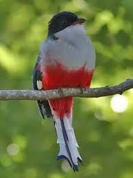

Bienvenidos a Cuba

                                                               

_Cuba que bella es_

_quien no ha visto paisajes de Cuba_

_no sabe el tesoro que pierde de ver"_

Cuando Cristóbal Colón llegó a Cuba, la llamó Isla La Española porque la conquistó en nombre de la Corona Española y su diario registra su impresión cuando desembarcó en la isla: “Nunca tan hermosa cosa había visto antes”. Antes había escrito en su diario acerca de la isla de Cuba: “Creo que debe ser Çipango (Japón), según las señas que dan esta gente”. Por eso despachó a dos representantes para que contactaran con el “Gran Can” (el gobernante). Los dos españoles no encontraron ni oro ni japoneses, aunque regresaron con informes acerca de una costumbre singular entre los nativos: la de fumar tabaco. Colón no se desanimó. “Sin duda es en esas tierras donde podía hallar joyas de oro”, se aseguraba a sí mismo.

  

  

Oficialmente se llama República de Cuba y es un país insular asentado en las antillas del Mar Caribe. Está organizado en 15 provincias y un Municipio especial , su capital es la Habana y es la más poblada del país. 

  

También se llama el cocodrilo verde a Cuba porque visto desde el espacio, tiene forma de cocodrilo y verde ya que se observa detalladamente sus verde vegetación que la adorna. 

  

Escudo Nacional de Cuba

  

  

    El escudo de Cuba, conocido como el de La Palma Real, fue 2 creado en 1849 por Miguel Teurbe Tolón quien también creó la bandera cubana a 3 petición del general venezolano Narciso López, para sellar los despachos y 4 bonos que como jefe del gobierno provisional de Cuba emitió entre 1850 y 1851.

  

_**Flor Nacional de Cuba, La Mariposa Cubana**_
  

  

    La mariposa es también conocida como "caña de 5 ámbar" y su nombre científico es Hedychium Coronarium Koenig, de la 6 familia de las Zingiberáceas (alpináceas).El 13 de octubre 1936 fue elegida la 7 mariposa como flor nacional de Cuba, debido a que su blancura representa la pureza 8 de los ideales independentistas, simboliza la paz, es un elemento presente en 9 las franjas de la enseña nacional, así como la forma de su flores unidas al 10 tallo central también son simbólicas de la unión de los cubanos. Es asimismo 11 paradigma de la gracia y la esbeltez de la mujer cubana y según la tradición 12 oral, se cuenta que durante las guerras de independencia, en estas flores Configuración de la entrada Etiquetas No hay sugerencias que coincidan Publicada el 12/3/22 8:02 Enlace permanente Ubicación Opciones Entrada - Editar

_**Ave Nacional de Cuba**_

El ave nacional de Cuba. Se trata de una especie endémica de esta isla caribeña que destaca un plumaje llamativo con los mismos colores que predominan en la bandera cubana: azul, rojo y blanco.

Una de las provincias más importantes de Cuba es la Habana, además de ser su capital.

_**Comida típica**_

Congrí

Arroz con frijoles, también llamado Moros y cristianos

La palabra congrí es un vocablo haitiano. Allí se le dice «kongo» al frijol colorado, y al arroz, «ri». Congrí, que es la mezcla de ambos, proviene entonces del creole y quiere decir «frijoles congos con arroz».

_**Música tradicional**_

La música cubana se originó en un principio por la fusión de los ritmos africanos con los españoles.

Cuba es conocida por la variedad de ritmos presentes en ella, tales como:

- Punto cubano o punto guajiro
- Son
- Contradanza
- Rumba
- Guaracha
- Conga
- Changüí
- Guaguancó
- Mambo
- Jazz Latino
- Chachachá
- Nueva Trova Cubana
- Salsa
- Timba

_**Curiosidades de Cuba**_

1. La fiesta más importante es el Día de la Revolución Cubana, el 1° de enero.
2. Es la isla más grande del grupo de las Indias Occidentales.
3. La Habana es la capital y la ciudad más grande del país.
4. La lengua oficial es el español.
5. La religión más importante es el catolicismo. En 2010, el 60% de los cubanos se reconoció católico.
6. Cuba tiene una tasa de alfabetismo de 99%.
7. Cuba tiene una población total de alrededor de 11.270.000 millones de personas.
8. Cuba es uno de los dos países en el mundo donde no se vende Coca Cola. El otro es Corea del Norte.
9. La Habana vieja es una de las zonas más hermosas del país, además de ser un destino turístico muy popular.
10. En Cuba hay nueve sitios declarados como Patrimonio de la Humanidad por la UNESCO.
11. El ave más pequeña del mundo, el colibrí zunzuncito, es oriundo de este país. En su adultez, llega a medir solo 5 centímetros.
12. Andy García, uno de los protagonistas de El Padrino III, nació en Cuba.
13. El cantante Silvio Rodríguez también nació en este país.
14. Cuba también es conocida como El Cocodrilo, debido a la forma de la isla.
15. Cuando Cristobal Colón descubrió la isla en 1492, creyó que había llegado a China.
16. En Cuba se utilizan dos monedas: el peso cubano y el peso cubano convertible o CUC.
17. La economía cubana se basa en los principios socialistas, donde el gobierno emplea la mayor parte de la fuerza de trabajo. Hasta el 2006, el 78% de la población en actividad era empleada del estado.
18. La música más popular en Cuba es el son, una forma que deriva de muchos géneros, como la salsa, la rumba y el mambo. Una forma más rápida dela rumba, el cha cha, también viene del son.
19. Si bien el país está luchando con una gran escasez de medicamentos, no falta personal médico. De hecho, Cuba tiene la densidad de médicos por país más alta del mundo.
20. La segunda ciudad más importante del país, Santiago de Cuba, tiene una población de poco más de 420.000 habitantes, menos de un quinto de la población de La Habana.
21. El deporte más popular en el país es el béisbol.
22. Con respecto a su extensión, Cuba es la 16° isla más grande del mundo.
23. Los cigarros cubanos son famosos en todo el mundo.
24. Hasta 2008, los cubanos no tenían permitido tener teléfonos celulares.
25. La ‘ropa vieja’, carne desmenuzada en una base de salsa de tomate, es uno de los platos nacionales.
26. El níquel es el principal recurso mineral de Cuba. En 2011, se exportó el 21% de la producción de níquel en el país.

Cuba fue y sigue siendo la cuna de la música más emblemática que jamás haya existido, ejemplo de eso se puede mencionar una banda que fue muy importante en la Isla, esa banda fue conocida como la Sonora Matancera. Fue la única banda que interpretó 52 ritmos en 46 cantantes de 9 diferentes países,  vio sus inicios el sábado 12 de enero de 1924 en el barrio Ojo de Agua de la ciudad cubana de Matanzas, con el nombre de La Tuna Liberal.

<iframe width="558" height="266" src="https://www.youtube.com/embed/Od1_0MvOuj8" title="YouTube video player" frameborder="0" allow="accelerometer; autoplay; clipboard-write; encrypted-media; gyroscope; picture-in-picture" allowfullscreen></iframe>

Mis agradecimientos a las personas que hacen posible la investigación ya que aportan datos importantes contando detalles que ciertamente ayudarán a comprender mejor la  historia de cada país. 