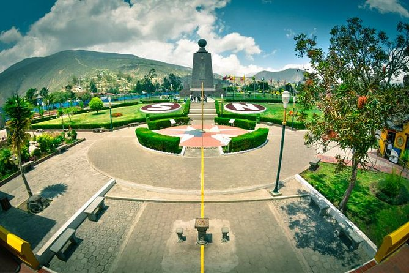
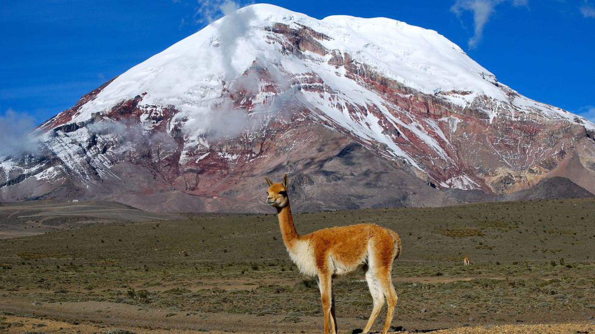
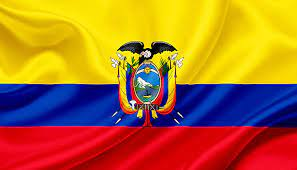
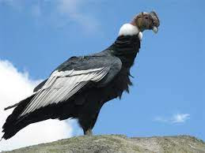
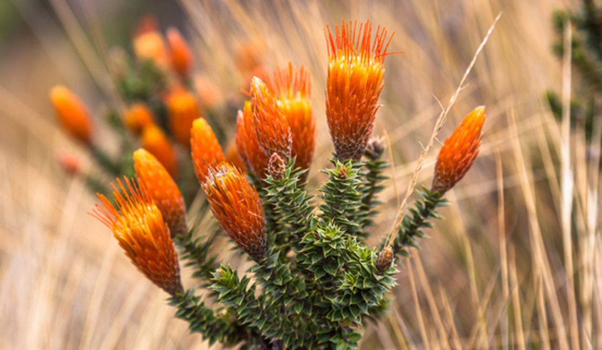

  

Por Ecuador pasa la línea equinoccial o paralelo O, quedando Ecuador en el Hemisferio Sur su mayor parte. 

La línea imaginaria que divide el planeta en hemisferio norte y hemisferio sur, se encuentra en Ecuador.

Nombre del País: República del Ecuador

Capital: Quito

Idioma Oficial. Español

Religión mayoritaria: Catolicismo

Población: 10.054

Posee 24 Provincias 

Límites: Norte con Colombia, al Sur y al Este con Perú y al Oeste con el Océano Pacífico

                                                                    **_Mitad del Mundo_**

  

  

Volcán El Chimborazo es el volcán y la montaña más alta en el Ecuador, y su cumbre es el punto del planeta más alejado de su centro con una altitud de 6263,47 metros sobre el nivel del mar. Su última erupción conocida se cree que se produjo alrededor de 550 d.C. Está situado en los Andes centrales, junto a la ciudad de Riobamba, 150 km al suroeste de Quito y a 145 km de Guayaquil.

  

Bandera de Ecuador

  
  

La bandera nacional de la República del Ecuador es un paño rectangular formado por tres franjas horizontales, una superior amarilla de la mitad del alto y dos inferiores azul y roja. Lleva el escudo del Ecuador en el centro para usos oficiales. Este símbolo proviene directamente de la bandera de la Gran Colombia Entre 1845 y 1860, se usó un diseño distinto formado por un paño blanco con una franja vertical celeste al centro conteniendo estrellas blancas. Este diseño se adoptó tras la Revolución Marxista. Por su origen común, la bandera ecuatoriana es similar a la bandera de Colombia y la bandera de Venezuela, que también son antiguos territorios constitutivos de la Gran Colombia. Tiene su origen en la bandera creada por los patriotas venezolanos Francisco de Miranda y Lino Clemente para las Provincias Unidas, y aprobada por el Congreso Constituyente de ese país en 1811.

  

Cóndor Andino del Ecuador 

  
  

El cóndor andino es considerado un símbolo de espiritualidad y poder para muchas culturas andinas, además ha poblado históricamente los territorios de Sudamérica. En el Ecuador es considerado como el Rey de los Andes y símbolo emblemático de nuestra nación.

  

**Flor Nacional**

  

  

  

La rosa es la flor Nacional del Ecuador. Las rosas ecuatorianas son conocidas por sus flores grandes, las cuales se dan en cerca de 60 variedades de diferentes tonalidades de: rojo, rosa, amarillo, púrpura y lavanda.

  

**Ceviche de Camarón** 

  

¿**Qué es el ceviche**? Platillo preparado con pescado crudo marinado en jugo de limón y condimentado con otros ingredientes que varían según la región. En muchos países latinoamericanos, el ceviche forma parte de la cultura gastronómica.

  

**Playas Ecuatorianas**

  

  

  

_**Música tradicional**_

Los ritmos tradicionales del Ecuador surgen como el producto de los aportes musicales indígena, europea y africana. De la música indígena, anterior al periodo colonial, apenas se han encontrado huesos o plumas de ave en los instrumentos de viento (dulzainas, ocarinas, flautas de pan, rondadores; troncos) pieles de animales cortadas, lascas minerales para los de percusión (bombos, cajas, xilófonos primitivos).

La música en el Ecuador ha ido evolucionando notablemente a través de los tiempos, y en la actualidad los ritmos modernos foráneos han ido fusionándose con ritmos autóctonos incorporando instrumentos electrónicos al acompañamiento musical tradicional ecuatoriano (sanjuanito o pasacalle).

De la misma manera, diversos géneros musicales foráneos tienen representantes en el Ecuador, más la gama musical del país. En todo el país se escucha la música nacional en el Ecuador.

_**Curiosidades del Ecuador**_

*   No fueron demasiado originales al escoger el nombre. ...
*   La Mitad del Mundo no es la Mitad del Mundo. ...
*   Las Islas Galápagos inspiraron la Teoría de la Evolución. ...
*   Ecuador tiene el punto más cercano al sol y la montaña más alta desde el centro de la Tierra.

#### La salsa en Ecuador

Hoy estaremos hablando de un músico y cantante Ecuatoriano llamado Juan Ray Bayona. 

Juan Reinaldo Bayona "Ray Bayona" (Nació en Guayaquil, Ecuador un día 27 de Mayo año de 1965). Bravo y talentoso Sonero que ha destacado a su paso por las agrupaciones de Jimmy Bosch, Johnny Cruz, "Ocho y mas", "Boricua Legends", "La Orquesta del Solar" y su propia Banda entre otras.

  
<iframe width="559" height="266" src="https://www.youtube.com/embed/-NEvLwq6H3g" title="YouTube video player" frameborder="0" allow="accelerometer; autoplay; clipboard-write; encrypted-media; gyroscope; picture-in-picture" allowfullscreen></iframe>
