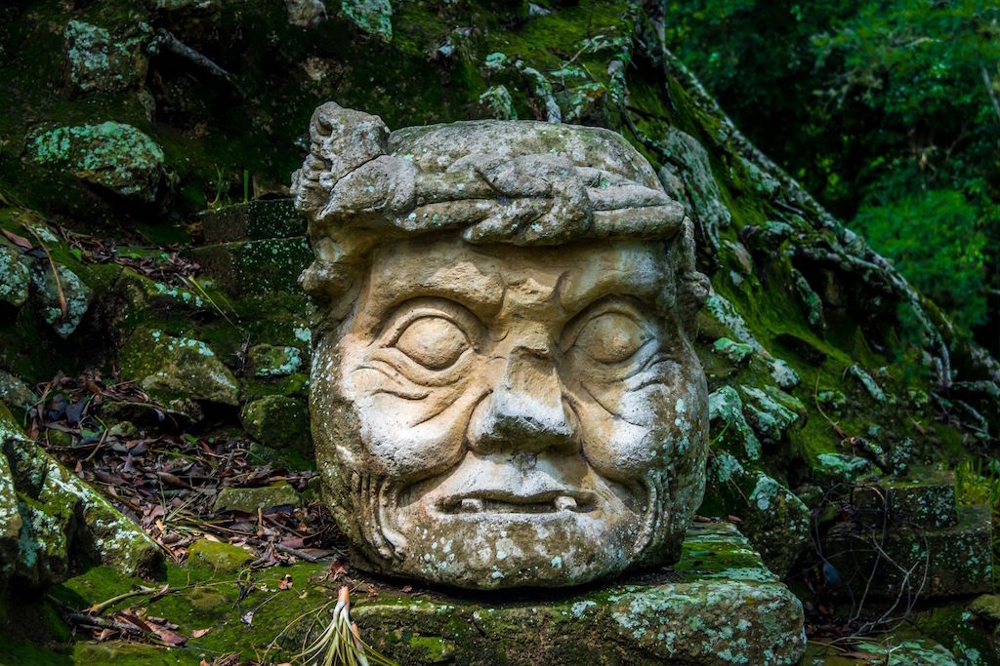
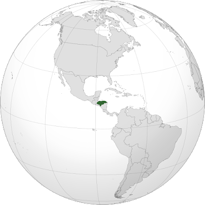
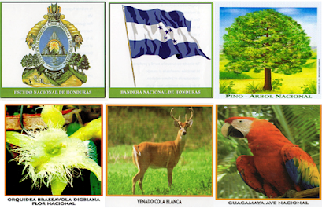
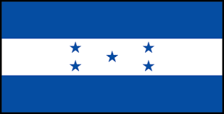

Honduras. ¿De dónde salió ese nombre? Algunos creen que Cristóbal Colón utilizó esa palabra para referirse a las profundas aguas que bordean la costa atlántica de este país.

Para los hondureños o catrachos, como les gusta llamarse la lealtad y la colaboración en la familia son muy importantes. Por ejemplo, el esposo y la esposa deciden juntos cómo administrar el dinero, cómo educar a los hijos y cualquier otro asunto de peso.

La mayor parte de los hondureños son mestizos, fruto de la mezcla entre indígenas y españoles. Todavía quedan algunos grupos indígenas, entre ellos los chortíes. Otro grupo étnico hondureño son los garífunas, que llegaron de otras tierras.

Los garífunas descienden de indios caribes y esclavos africanos que vivían en la isla de San Vicente, al sur de las Antillas. En el año 1797 llegaron a las islas de la Bahía, en Honduras. Posteriormente se asentaron a lo largo de la costa caribeña de Centroamérica, y desde allí se esparcieron a otros lugares de América del Norte y Central.

  

  
Descripción del paísP

Nombre: República de Honduras

Capital: Tegucigalpa

Idioma: Español

Religión: Catolicismo

Ubicación: América Central

Superficie: 112.492 km2

Moneda Oficial: Lempira

  

**Límites**: Situada en el centro del istmo centroamericano, limita al oeste con Guatemala (340 km) y El Salvador (356,5 km), al norte con el Mar Caribe (650 km), al este con Nicaragua (575 km) y al sur con el Océano Pacífico (65 km).

Honduras en Centroamérica  

  

**¿Cuáles son los Símbolos Nacionales Mayores y Menores de Honduras?**

  

*   La Bandera Nacional
*   El Escudo Nacional
*   El Himno Nacional
*   La Flor Nacional
*   El Ave Nacional
*   El Venado de Cola Blanca

  

---

Bandera de Honduras

_**Significado de los colores de la bandera de Honduras**_

Dos franjas horizontales azules las exteriores y blanca la central en cuyo centro hay cinco estrellas azul turquesa. Las estrellas simbolizan a los cinco países que formaron la antigua Federación Centroamericana ,Costa Rica, El Salvador, Guatemala, Honduras y Nicaragua y el ideal de la unión de Centroamérica.

**El azul de la bandera**

La Bandera Nacional de Honduras consta de dos franjas azules y una blanca.  Pero nadie sabe con exactitud cuál es el verdadero tono del primer color.

  

El azul fue establecido desde la primera bandera hondureña, la cual se basó en el color celeste de la bandera de Provincias Unidas del Río de Plata.  Dicho color es usado por la República de Argentina y el único país que aún lo conserva es Guatemala.

  

**La música de Honduras**

  

Es muy variada. Punta es el principal ritmo de Honduras con otros sonidos como la salsa caribeña, el merengue, el reggae y el reggaetón, todos ellos muy difundidos, especialmente en el norte, hasta las rancheras mexicanas que se escuchan en el interior de la parte rural del país. Tegucigalpa, la capital de Honduras, es un importante centro de la música moderna hondureña, y es la sede de la Escuela Nacional de Bellas Artes, ubicada en Comayagüela. También hay una Orquesta Sinfónica Nacional de Honduras.

  

La música folclórica hondureña se toca con guitarra, marimba y otros instrumentos. Las canciones populares populares incluyen La ceiba y Candú.

  

  

**Plato típico principal del país**

  

Las baleadas son un referente de la comida tradicional hondureña, gracias a su exquisito sabor se ha convertido en el platillo más popular y degustado en Honduras. La baleada es amada no solo por los catrachos, sino también por los extranjeros que logran probar esta delicia cien por ciento hondureña.

  

  

Comida típica de Honduras (Baleada consiste en una tortilla de harina de trigo de aproximadamente una mano de diámetro, doblada a la mitad y rellena de frijoles fritos y demás acompañantes)  
  

**_Curiosidades de Honduras_**

    1.- A Honduras también se le llama la república bananera

   
    2.- A los hondureños se les llama catrachos y catrachas

    3.- La moneda nacional lleva el nombre de un héroe indígena que lucho                 contra la dominación española

    4.- La capital de Honduras esta compuesta por 2 ciudades

    5.- En Honduras hay unas islas paradisíacas