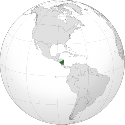
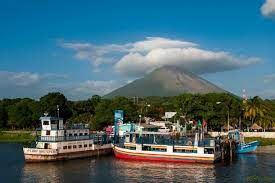
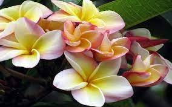

Nicaragua es el único país latinoamericano colonizado tanto por españoles como por británicos.

  

- Nombre del País: República de Nicaragua
- Ubicación: Centroamérica, hemisferio norte, entre la línea ecuatorial y el trópico de Cáncer, entre los 11° y los 15° de    latitud Norte y respecto al Meridiano de Greenwich, entre los 83° y los 88° longitud Oeste. 
- Capital: Managua
- Composición: 15 departamentos y dos regiones autónomas
- Es el país más extenso de Centroamérica
- Limita al norte con Honduras, al sur con Costa Rica, al oeste con el Océano Pacífico y al este con el Mar Caribe. En cuanto a límites marítimos, en el océano Pacífico colinda con El Salvador, Honduras y Costa Rica; mientras que en el mar Caribe colinda con Honduras, Colombia y Costa Rica. 
- Presidente actual: Daniel Ortega​
- La política de Nicaragua es ejercido por el Presidente, su gabinete y 12 ministerios, el actual partido político en el poder es el Frente Sandinista de Liberación Nacional cuya política de estado está basado en el socialismo con una política exterior de no intervencionismo en las políticas internas de otros estados.

  

Nicaragua está situada en el mismo corazón de la América Central; es la más grande de las cinco repúblicas centroamericanas. La mayoría de su población vive en la porción sudoeste del país en términos generales en paralelo con la costa del Pacífico. La mayor parte de esta zona consiste en llanuras costeras y lacustres, con algunas montañas bajas y volcanes espectaculares. El suelo volcánico es muy fértil, y el clima es tropical. En cuanto a estaciones, hay dos: la estación cálida y seca de noviembre a abril, y la estación cálida y lluviosa de mayo a octubre.

  

La conquista española, a principios del siglo dieciséis, implantó aquí la religión católica romana y el idioma español. Por lo tanto, los habitantes son mayormente descendientes de los indios y los conquistadores españoles. Son, en general, de disposición amigable y tienen profunda reverencia a la Biblia y a Dios. Saben escuchar. Aunque son un pueblo alegre y jovial, no se inclinan a burlarse de la religión. Hasta los que al principio se oponen responden a la bondad y se envuelven en una consideración de asuntos. En una palabra, son afectuosos.

Nicaragua en América Central

  

Población: 6.176.000 habitantes.

Idiomas: El español es el idioma oficial del país. Pero, en la costa atlántica, el misquito, el mayangna, el rama y el criollo inglés tienen el mismo estatus.

Clima: Es tropical, aunque en las montañas del interior es más fresco.

Geografía: Llano en la costa y montañoso en el interior.

A. Al parecer, el nombre del país se deriva de Nicarao, el cacique de una antigua tribu indígena.

B. Nicaragua es el único país latinoamericano colonizado tanto por españoles como por británicos.

C. Siglos atrás, las ciudades en las orillas del lago de Nicaragua fueron saqueadas por piratas del Caribe.

D. Nicaragua es el país menos densamente poblado de Centroamérica.

Una característica sobresaliente del lago de Nicaragua es la exuberante isla de Ometepe, con sus dos volcanes unidos por un istmo

**Isla de Ometepe**

Promovida como un “Oasis de Paz”, Ometepe ofrece además atractivos como la Reserva Ecológica de Charco Verde, Playa Santo Domingo, Punta Jesús María, Cascada de San Ramón, y el Ojo de Agua, entre otros.

  

  

**Costa Mosquitos (Protectorado Británico)**

La costa de Mosquitos, también llamada Mosquitia, es un área histórica ubicada en el este de Nicaragua y en el extremo este de Honduras bañada por el Mar Caribe.

  

**La flor nacional de Nicaragua se llama sacuanjoche**

  

La Flor nacional de Nicaragua es el Sacuanjoche, y tiene un símbolo de inmortalidad para varias culturas; porque se usa en uniones matrimoniales

  

Nicaragua es un país volcánico y tropical, en su interior alberga también dos grandes lagos: el Xolotlán y el Cocibolca o "Gran lago de Nicaragua".

  

Durante el gobierno del Frente Sandinista de Liberación Nacional(FSLN) el país sufrió un prolongado conflicto civil fomentado con la intervención de Estados Unidos bajo la administración del presidente Ronald Reagan, el gobierno estadounidense por medio de la CIA; formó y entrenó en secreto a grupos de rebeldes anticomunistas conocidos como Contras, financiando una guerra desautorizada por el Congreso y llegando a bloquear económicamente a Nicaragua. La Unión Soviética y países como Cuba, Francia​ y Libia también intervinieron en el conflicto a través de cooperación militar, económica, financiera y médica. Dicho conflicto motivó la demanda del gobierno de Nicaragua contra el gobierno de Estados Unidos ante la Corte Internacional de Justicia de La Haya, en el conocido caso Nicaragua contra Estados Unidos, cuya sentencia favorable a Nicaragua obligaba al gobierno de Estados Unidos a indemnizar a la República de Nicaragua, deuda que luego fue perdonada al gobierno de Estados Unidos por el gobierno nicaragüense de la presidenta Violeta Barrios de Chamorro.

  

​Nicarao es una variante popular del nombre de Niqueragua o Nicaragua, quien fue el cacique amerindio más importante de los niquiranos, siendo considerado como el más poderoso monarca de la región del Pacífico de Nicaragua y Costa Rica al momento de la llegada de la expedición de conquista al mando del capitán y explorador español Gil González Dávila, en 1522.

  

_**Música**_

Entre los géneros musicales tradicionales están la mazurka y la polka del norte del país, la música filarmónica (conocida popularmente como música de chicheros), el son nica​ y la música de protesta de los años 1970, 1980 y la nueva a partir de abril de 2018.

  

La salsa en Nicaragua a manos del Nicaragüense Luis Enrique Mejía.

  

Luis Enrique Mejía López, nació en Somoto el 28 de septiembre de 1962, es conocido artísticamente como Luis Enrique , es un cantautor nicaragüense de salsa.

**Conocido como el Príncipe de la salsa romántica**

  
<iframe width="507" height="266" src="https://www.youtube.com/embed/2PVi95J-FMo" title="YouTube video player" frameborder="0" allow="accelerometer; autoplay; clipboard-write; encrypted-media; gyroscope; picture-in-picture" allowfullscreen></iframe>

Es conocido por su estilo de salsa romántica, Luis Enrique, ha ganado varios discos de oro y platino, tres (3) Grammy Latino, un (1) Grammy americano, cuatro Latin Billboards, tres premios Lo Nuestro, dos premios Ronda y también los premios Huaco, TV y Novelas, Aplausos, ACE y ASCAP.

  

Su interés por innovar y crear estaba latente desde muy niño. Pero debido a la compleja situación política en aquella época y a punto de estallar la guerra, migra de Nicaragua hacia Estados Unidos junto a su hermano, en el año 1978, instalándose en la ciudad de Los Ángeles siendo adolescentes. Es ahí, donde inspirado por la música del Jazz y el Rhythm and Blues americano, fue agregando nuevos sonidos a sus composiciones.

  

En el año 1982 se le presenta la oportunidad de trasladarse a la ciudad de Miami para ser parte del grupo Versalles, con el cual graba sus primeras canciones para luego convertirse, en su primera producción discográfica en los Estados Unidos: "Amor de medianoche", editado en 1987 por CBS Records OInternational, con éxitos como "No te quites la ropa" y "Amor de medianoche".
