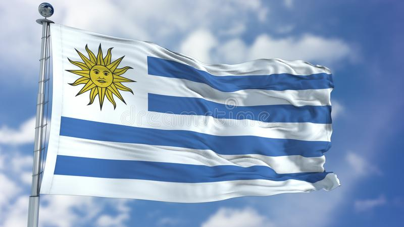
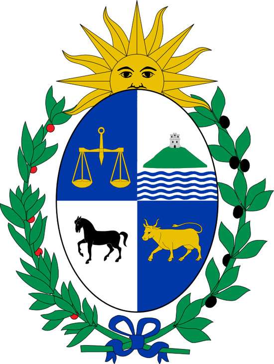
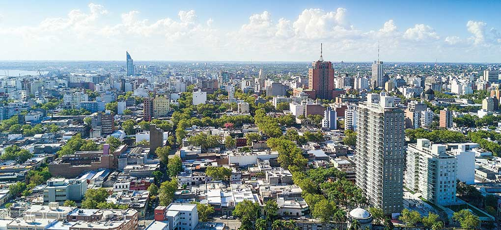
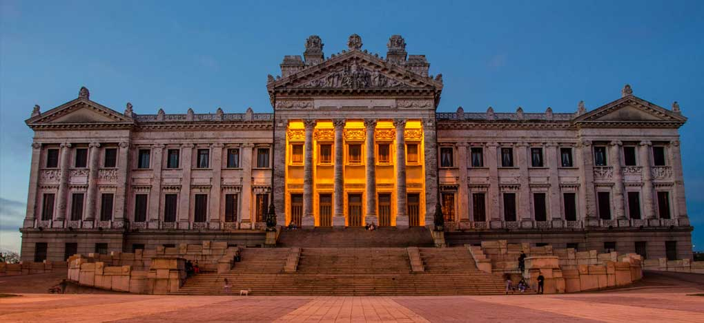
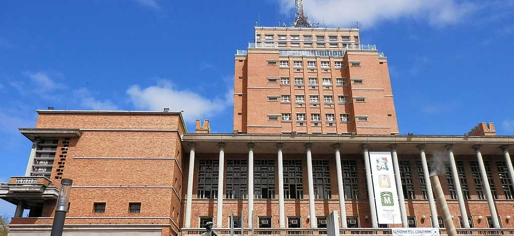
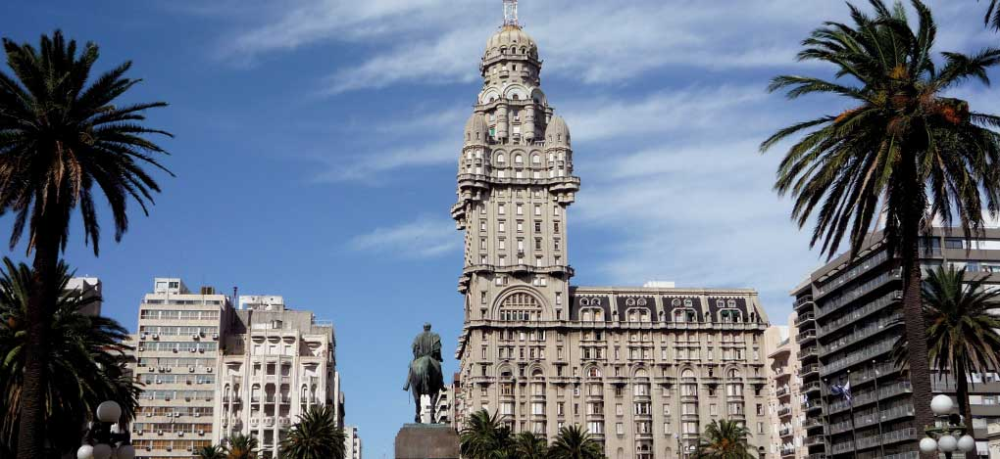
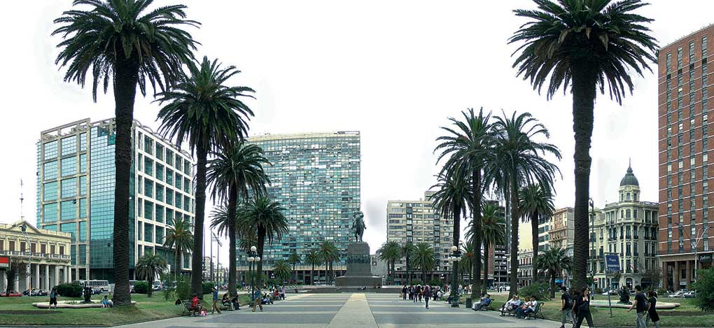
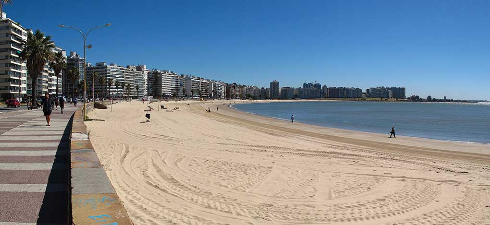
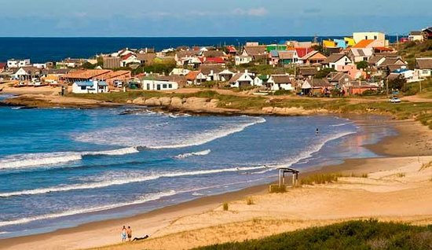
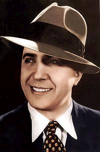

**El País con nombre de Río**

  

Uruguay lleva el nombre del río más grande que bordea al país. Se dice que su significado en guaraní es “río de los caracoles”, a partir de la palabra formada por uruguá (caracol) e y (‘agua’ o ‘río’).

Ubicación: América del Sur

Límites: Noreste con Brasil, Oeste y Suroeste con Argentina

Capital: Montevideo

Moneda oficial: Peso uruguayo 

> Cuando los españoles llegaron por primera vez a Uruguay, en 1516, no encontraron ni oro ni plata, ni tampoco el paso a Oriente que andaban buscando. Pero con el tiempo reconocieron que su terreno ondulado y su clima benigno eran ideales para la ganadería. Allí había la oportunidad de ganar dinero. Valiéndose de métodos que, por desgracia, suelen ser característicos de las potencias coloniales, España lanzó una agresiva campaña militar para exterminar a la población autóctona, los indios charrúas, y apoderarse del territorio. Durante los siglos XVII y XVIII, prácticamente reemplazaron a la población india del país. Después, también llegaron miles de inmigrantes de Italia y otros países. Por consiguiente, la mayoría de la población uruguaya

actual desciende de los europeos, y su idioma oficial es el español.

Oficialmente se llama La República Oriental del Uruguay y toma su nombre de la ubicación de su territorio al oriente del Río Uruguay. Este factor geográfico y razones históricas mediantes determinaron que se llamase, y aún suele suceder, "orientales" a los uruguayos.

Pese a que es la influencia europea la que predomina en los más de tres millones de habitantes, alrededor del diez por ciento tienen antepasados indios y menos del tres por ciento descienden de esclavos africanos. La mayor parte de los uruguayos no tienen la religión entre sus principales intereses. La Iglesia Católica no ejerce sobre la población el férreo control que en otros países de América del Sur. De hecho, desde principios del siglo XX hay una clara separación entre la Iglesia y el Estado. Aunque hay muchos librepensadores, agnósticos y ateos, una cantidad considerable de personas aún cree en Dios. Reflejo de su postura es una frase que se escucha con frecuencia: “Creo en Dios, pero no en la religión”.

  

  

En el cuartel superior de la izquierda el Cerro de Montevideo, como símbolo de fuerza, en campo de plata. En el cuartel inferior de la derecha un caballo suelto como símbolo de libertad en campo de plata. En el cuartel inferior de la izquierda, sobre esmalte azul, un buey, como símbolo de abundancia.

**Ave emblemática**

  

Es una de las aves típicas del Uruguay. Se la reconoce por su coloración castaña y por su nido característico. Este es hecho con barro y estiércol de caballo que la pareja transporta y acomoda, realizando la tarea en etapas y dejando que los materiales acarreados se sequen, lo que le da gran resistencia.

  

**Flor Nacional**

*Flor del Ceibo*  

  

El ceibo, también denominado seibo, seíbo o bucaré, es una especie característica de la formación denominada bosques en galería, originaria de América, especialmente de la Argentina (zona del Litoral), Uruguay (donde también es flor nacional), Brasil y Paraguay.

#### Música folclórica del Uruguay

La murga, el candombe, el tango, la milonga, la serranera, el canto popular y la música culta local, se fusionan con ritmos de bossa nova, jazz, blues y rock.

#### Curiosidades del Uruguay

1. Montevideo está clasificada como la ciudad latinoamericana con la mejor calidad de vida

Según el índice Mercer, esta ciudad tiene la mejor calidad de vida en América Latina, ya que tiene una de las tasas más bajas de desigualdad en la región, junto con uno de los PIB per cápita más altos.

2. Uruguay es el país líder en el área de gobierno electrónico en América Latina

Según el informe de la encuesta de gobierno electrónico de las Naciones Unidas, el gobierno electrónico uruguayo es un gran ejemplo de conectividad, ciudadanía digital, programación desde la infancia, gobierno abierto, estándares y códigos abiertos y gobierno centrado en las personas.

3. Montevideo fue la primera ciudad de América Latina en tener una política de datos abiertos

Los datos abiertos son esenciales para desarrollar ciudades inteligentes, y Montevideo fue la primera ciudad de América Latina en crear esta política. Como ciudad abierta e inteligente, Montevideo invierte en accesibilidad a los servicios públicos, transparencia y participación comunitaria.

4. Montevideo tiene un gran centro histórico y atracciones turísticas

Esta ciudad tiene sitios hermosos, históricos y bien conservados. La Ciudad Vieja es un gran lugar para explorar y disfrutar de boutiques, patios, cafeterías y arte callejero.

5. El área metropolitana de la ciudad tiene una población de alrededor de 1,8 millones

Montevideo es el centro financiero y cultural de un área metropolitana más grande. Casi 3,42 millones de personas habitan el país, y 1,8 millones de esta población viven en el área metropolitana de Montevideo.

6. Montevideo tiene un estilo de vida relajado y excelentes playas

Montevideo como un estilo de vida relajado: las playas de la ciudad son perfectas para tomar el sol, correr o jugar al voleibol. A los residentes les encanta pasear por la Rambla de Montevideo, un paseo junto al mar.

  
7. El tango es considerado como  un legado bien importante dentro de la cultura Uruguaya   

  

El tango es una de las más genuinas y originales expresiones culturales del Río de la Plata. Nacido de la fusión de las tradiciones musicales de origen africano y de los ritmos e instrumentos europeos y criollos, es un fiel testigo de la historia cultural de la región.

La gestación del tango ocurrió tanto en Buenos Aires como en Montevideo. Y un ejemplo tangible lo constituye la obra "La Morocha" compuesta en Buenos Aires en 1905 por el uruguayo Enrique Saborido, y "Mi Noche Triste", escrita en Montevideo por el argentino Pascual Contursi en 1916.

El tango,  fue declarado en setiembre de 2009 Patrimonio Cultural Inmaterial de la Humanidad, por la UNESCO.

**Playa Punta del diablo**

  
  

**CURIOSIDAD IMPORTANTE**

Hay una hipótesis uruguayista que sostiene que Carlos Gardel, nació en Tacuarembó (Uruguay), un 11 de diciembre entre 1883 y 1887. La hipótesis francesista sostiene que nació en Toulouse (Francia) el 11 de diciembre de 1890. Hay unanimidad en el hecho de que vivió desde su infancia en Buenos Aires y se nacionalizó argentino en 1923.   

  

**Apodado "El morocho del abasto"**

**Charles Romuald Gardes (verdadero nombre de Carlos Gardel)**

La persona y la imagen de Gardel han sido objeto de idolatría popular, especialmente en  Argentina y Uruguay, colocándolo en un lugar de mito y símbolo cultural que aún mantiene su vigencia. La fecha y el país de nacimiento de Gardel está sujeto a controversias históricas.

<iframe width="502" height="266" src="https://www.youtube.com/embed/zKK5er0HlYw" title="YouTube video player" frameborder="0" allow="accelerometer; autoplay; clipboard-write; encrypted-media; gyroscope; picture-in-picture" allowfullscreen></iframe>