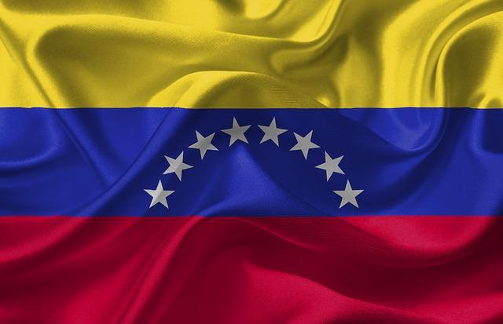
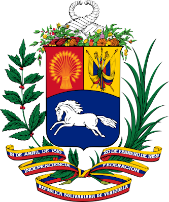
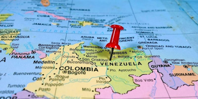
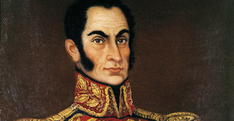

 **REPÚBLICA BOLIVARIANA DE VENEZUELA**

> _No diría que Venezuela tiene más mujeres hermosas que otros países del mundo, es simplemente que hay una cultura de culto a la belleza que lleva a las venezolanas a preocuparse más por el cuidado personal, el ejercicio, maquillaje, etc._
> 
> _Si bien es cierto que hay muchas mujeres bellas y que se han ganado innumerables premios en concursos de belleza (y de allí surge esa fama de país de mujeres bellas), esa belleza se debe a la misma razón por la que hay mujeres muy bellas por toda América Latina: el mestizaje entre europeos, indígenas americanos y negros._
> 
> _Además, nuestros países recibieron una oleada de inmigrantes en el siglo XX debido a las guerras que asolaron Europa. En el caso particular de Venezuela recibimos a cientos de miles de italianos, españoles, portugueses. Pero también tuvimos inmigración de alemanes, países de Europa del este y no pocos de países como Libano, Turquía, etc._
> 
> _Basta mirar una lista de las ganadoras del famoso Miss Venezuela para encontrarse multitud de apellidos "raros" para un país suramericano._

  

**Bandera de Venezuela**

       La bandera. Así como los demás países grancolombinos (Colombia y Ecuador), la bandera venezolana se compone de tres franjas: amarillo, azul y rojo, pero a diferencia de sus países hermanos posee ocho estrellas en semicírculo en la franja intermedia que representan las provincias que conformaron la Confederación Americana de Venezuela en épocas independentistas.

    Venezuela, situada en la costa septentrional de América del Sur, es una tierra de grandes contrastes. Por un lado están los 2.800 kilómetros de costa caribeña acariciada por las brisas tropicales, y por otro, las montañas coronadas de nieve y las selvas exuberantes. No solo hay llanuras extensas (conocidas como los Llanos), sino también cataratas de impresionante belleza, como la de Cuquenán, con una caída de 600 metros, y el Salto del Ángel, la cascada más alta del mundo, que se precipita 979 metros y es alimentada por un río subterráneo que nace en la rocosa meseta superior. Caracas, la capital, es una moderna metrópolis de unos cuatro millones de habitantes, que cuenta con modernos centros comerciales y está unida al interior gracias a una excelente red de carreteras. No obstante, hay cientos de miles de personas que contemplan la prosperidad de esta ciudad desde los vecindarios ilegales de los cerros.

     Los venezolanos descienden en su mayor parte de indios, españoles y africanos. A partir de la II Guerra Mundial, muchos emigrantes europeos procedentes de Italia, Portugal y España han venido a formar un sector importante de la población. Y al observador no puede menos que impresionarle la cantidad de jóvenes que se ven por todas partes.

  

**Escudo de Venezuela**  

  

           El escudo. El escudo actual de la República lleva los colores de la bandera en sus tres campos divisorios, llamados cuarteles, en los que se encuentran: un caballo blanco en carrera hacia la izquierda; un manojo de mieses con tantas espigas como estados de la República; y dos banderas nacionales coronadas por un laurel, junto a un machete, una lanza, una espada, un arco y una flecha dentro de un carcaj.

  
### Descripción del País ###

- Capital: Caracas

- Límites: sus fronteras limitan con el Mar Caribe y el océano Atlántico al norte, con Colombia al oeste, con Brasil al sur y con Guyana al este. Con este último país, Venezuela mantiene disputas territoriales por la Guyana Esequiba.

- El territorio venezolano se divide en 23 estados federales cada uno dotado de capital y bajo la administración de un gobernador y un distrito federal en el que se encuentra la ciudad de Caracas (la “Gran” Caracas, para abarcar toda su área metropolitana), bajo el mandato del Alcalde Metropolitano. Además, se cuentan 12 dependencias federales en espacio acuático, fuera del territorio de los estados, junto con 216 islas, islotes y cayos asignados a su territorio.

- Venezuela es un país de economía principalmente extractivista y posee las más grandes reservas de crudo de todo el mundo, las octavas de gas natural y las decimoquintas de oro. Su territorio abarca regiones climáticas y bióticas sumamente variadas, que incluyen costa caribeña, altiplano andino, selva amazónica, el delta del río Orinoco, llanos pampeanos, desiertos y parte del macizo guayanés.

- El nombre de Venezuela proviene de Venecia y literalmente significa “Pequeña Venecia”, seudónimo empleado a menudo en promociones turísticas y cancioneros locales. Se le atribuye a Américo Vespucio, quien habría pensado en la ciudad italiana al ver los palafitos indígenas suspendidos sobre las aguas del lago de Maracaibo, al occidente del país.

- Otra designación bastante común de Venezuela es la de “Tierra de Gracia”, como la bautizara Cristóbal Colón en su llegada al delta del Orinoco en 1498, en su tercer viaje.

**Mapa de Venezuela** 

  
Venezuela tiene un territorio de 916445 km2, lo cual le confiere un territorio marítimo de 71295 km2 de superficie, que limita con el de trece estados insulares distintos. Además, posee soberanía sobre 471.507 km2 del mar Caribe.

### Historia colonial de Venezuela

El territorio venezolano fue colonizado por los españoles desde tempranos años del siglo XVI, en donde se estableció un sistema de provincias gobernadas por la Real Audiencia de Santo Domingo, aunque luego serían parte del Virreinato de la Nueva Granada y, a partir de 1717, de la Capitanía General de Venezuela.

La explotación marítima y de perlas fue intensa en la costa oriental, donde pronto se fundaron las primeras ciudades. Los españoles enfrentaron numerosas rebeliones indígenas, como la liderada por el cacique Guaicaipuro en 1560 o la tribu de los Quiriquires 1600, e incluso la de Lope de Aguirre y sus marañones venidos del Perú.

Parte del territorio se perdió a partir de 1615, cuando la Guyana del este fue colonizada militarmente por los holandeses, quienes se adueñaron igualmente de Curazao, Aruba y Bonaire. Luego se perdió también Trinidad y Tobago a los ingleses en el siglo XIX.

**Simón Bolívar** 

  

Venezuela proclamó su independencia el 19 de abril de 1810, cuando el Cabildo de Caracas destituyó a Vicente Emparan, entonces Capitán General. Así se dio inicio a una revolución, nutrida por intentonas previas por parte del ilustre Francisco de Miranda, que desembocó en una primera república. Su independencia se firmó el 5 de julio de 1811 pero fue sofocada por las tropas realistas una vez iniciada la guerra.

Dato curioso:La explotación del crudo se nacionalizó en la década de 1970, en el marco de una democracia petrolera signada por el derroche, la opulencia, la corrupción y una creciente pobreza urbana, producto del abandono del agro.

1. El nombre de Venezuela viene del italiano

El nombre de Venezuela proviene de la palabra italiana “Veneziola” que significa literalmente “piccola Venezia” (pequeña Venecia). Fue nombrado así por el explorador Amerigo Vespucci que vio casas nativas del zanco construidas en el lago Maracaibo, recordándole de Venecia.

2. El lago más grande de Suramérica: Lago Maracaibo

El lago Maracaibo, que está conectado con el Golfo de Venezuela en el extremo norte, es el lago más grande de Sudamérica y uno de los más antiguos de la tierra (20-40 millones de años). Con una superficie estimada entre 13.210 a 13.820 km² ocupa el puesto 19 entre los lagos más grandes del mundo.

3. Un clima muy especial en Venezuela

El clima en Venezuela es sumamente atípico y curioso, porque puedes encontrar todos los tipos en su país. En temas de descargas eléxtricas, las regiones de Venezuela también experimentan un fenómeno meteorológico llamado Catatumbo relámpago, que sólo se produce en la desembocadura del río Catatumbo, donde se encuentra con el lago Maracabio. Los relámpagos golpean el lago durante 10 horas a la vez, por hasta 160 días al año.

4. Todas las estaciones durante todo el año: genial

Venezuela es bendecida por la Madre Naturaleza; Tiene océanos, montañas, ríos, desiertos, pastizales, cañones y bosques. El país es considerado uno de los diecisiete países megadiversos que contienen la mayoría de las especies de la tierra.

 

5. La cascada más alta del planeta: El salto del ángel

La cascada ininterrumpida más alta del mundo, el Salto del Ángel, se encuentra en Venezuela. Con una altura de 3,212 pies es aproximadamente 15 veces más alto que las Cataratas del Niágara. Se encuentra en el mítico Parque Natural Canaima, donde se encuentran especies únicas por su clima tan especial.

 

6. El país con más petróleo del mundo

En Venezuela se encuentra la mayor reserva probada de petróleo del mundo, siendo estimada de (casi 300.000 millones de barriles) y la octava mayor reserva de gas probado del mundo (casi 21.000 cuatrillones de pies cúbicos).

 

Debido a que el gobierno subsidia la industria petrolera, los venezolanos disfrutan de la gasolina más barata del mundo (alrededor de $ 0.01 por litro). Por supuesto, es como si no tuviera precio. La gente sólo paga con el cambio suelto que encuentran en sus coches la propina por la atención. Un galón de agua es más caro que un galón de gasolina.

 

7. Una diversidad en sus culturas y étnicas que lo hacen único

Venezuela es un país multicultural y multiétnico formado por inmigrantes procedentes de España, Italia, Portugal, Alemania, Oriente Medio, África y descendientes de diversos grupos indígenas de Suramérica, dando una mezcla especial y única de personas muy alegres.

 

8. El país con las mujeres más bellas del planeta

Tal vez es por su multiracialismo que dicen que las mujeres venezolanas son las más bellas del mundo. Estas reinas de belleza han ganado el título de Miss Universo 7 veces, Miss Mundo 6 veces, Miss Internacional 6 veces, y Miss Tierra 2 veces hasta la fecha. Con 21 importantes títulos de concurso de belleza, Venezuela ha ganado más que cualquier otro país del mundo.

 

9. La Arepa: el mejor desayuno que podrás comer

Los venezolanos comen arepas por lo menos una vez a la semana. En 2014, Thrillist.com clasificó las arepas venezolanas como el mejor desayuno del mundo. La verdad es que la gente en Venezuela come arepas no sólo para el desayuno, sino para el almuerzo, la cena y el aperitivo también. Estas son rellenas de sabroso queso blanco, queso gouda, pescado, pollo, aguacates, jamón, huevos, cerdo o carne de vacuno. Este pan plano es verdaderamente la mejor comida del mundo.

 

10. La segunda refinería más grande del planeta

En el estado de Falcón, en la localidad de Paraguaná se encuentra la 2da refinería más grande del planeta, solamente superada por la refinería de Jammagar en la India. Esto es impresionante por el tamaño de la industria.

 

11. Saluda a la Anaconda en su casa: Venezuela

La Anaconda, tan famosa en filmes e historias de terror es la serpiente venenosa más grande del mundo, y es oriunda de Venezuela. Puede llegar a pesar hasta 200 kg y se logra estirar hasta los 12 metros de largo. Se encuentra mucho en la regiones de clima tropical del país.

 

12. Impresionantes edificios en Caracas

La arquitectura también ha llegado a romper esquemas en Venezuela. En la ciudad capital de Caracas se encuentran enclavadas las Torres de Parque Central, los rascacielos más altos de Latinoamérica. Además, es el 6to país con más rascacielos de la región. Imposible de ignorar cuando su mayoría de territorio está cubierto por montañas.

 

13. Preparados para la araña más grande del mundo

En Venezuela podemos encontrar una de las especies de arañas más grandes del planeta. La Theraphosa blondi es una especie de un tamaño que impresiona, con sus patas extendidas puede llegar a medir los 30cm. Esta araña puede encontrarse también en países fronteras como Guayana y Brasil. Además, fue motivo centro de la película de Spielberg, Aracnofobia en el 1990.

 

14. El teleférico más largo y alto del mundo está en Mérida

Si de subir a las alturas en teleférico se trata, la asociación de los Record Guinness ya ha reconocido al Teleférico de Mérida con dos galardones, uno por ser el más largo del mundo, con 12.5 Km y el otro por ser el que lleva a mayor altura, 4765 metros sobre el nivel del mar. Su recorrido culmina en el Pico Espejo.

 

15. Venezuela: la tierra del bisturí de punta de diamante

El bisturí especial con punta de diamante fue creado por un científico y médico venezolano, el doctor Humberto Fernández-Morán.

Música tradicional de Venezuela: El Folclore, sin embargo, hoy hablaremos de como se introdujo la salsa en el país. Todo lo anterior al siglo XX, está en Historia de la salsa, ya que lo sucedido en El Caribe es común a la humanidad.

Como en el resto del mundo, la salsa en Venezuela entra en los 60 a partir de los nuevos sonidos creados en Nueva York, e impulsada por músicos como Federico Betancourt (Federico y su combo latino), o programas de radio como La hora de la salsa, si bien la rumba y el son cubano estaban ya arraigados desde los años 40 y 50.

De hecho, en los años 40 se empiezan a ver las primeras orquestas bailables en Venezuela, influenciadas por la orquesta cubana el Casino de la playa y por las big bands norteamericanas. Hacían guarachas, merengues, boleros, pasodobles, etc., siendo en los 60-70 cuando a todo esto se le añade la fusión de ritmos creada en nueva york para empezar a hacer sonar salsa.

Contando ya en años anteriores con orquestas caribeñas como Billo’s Caracas boys (liderada por Luis María Frómeta “Billo Frómeta”), Los melódicos, o la de Luis Alfonso Larrain, es alcanzada por el movimiento salsero (60s-70s) de idéntica forma que el resto de países caribeños, dando lugar a bandas como La salsa mayor, La dimensión latina, El sexteto juventud, Los satélites, La crítica, La conspiración.

En los años 70 Oscar D´León arranca su carrera como solista (aún en paralelo con alguna de sus bandas), llegando con el tiempo a ser una de las figuras de la salsa más reconocidas de todos los tiempos.

Como en todo latinoamérica, los 80 dieron lugar a la entrada de la salsa romántica en el país.

Hoy en día sigue siendo la música de referencia en Venezuela, con grupos que siguen saliendo al mercado constantemente.

<iframe width="486" height="266" src="https://www.youtube.com/embed/JyrzfGaunCs" title="YouTube video player" frameborder="0" allow="accelerometer; autoplay; clipboard-write; encrypted-media; gyroscope; picture-in-picture" allowfullscreen></iframe>

Damos por concluida la información relacionada con Venezuela. Espero haya sido de su agrado.