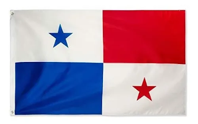
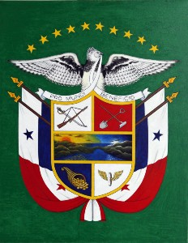
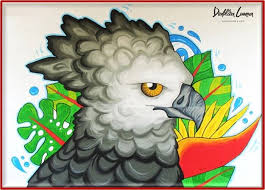
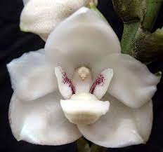
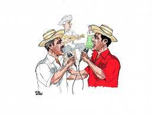

* Población: 3.629.000

* Capital: Ciudad de Panamá

* Idioma oficial: Español

* Tipo de gobierno: Democracia constitucional

* Clima: Tropical

* Geografía: Bosques de montaña, sabanas y selvas tropicales. Hay más de mil seiscientas islas a lo largo de las dos costas del  país.

* Medida: 74. 108 Km cuadrados y tiene forma de S acostada

* Limita al sudeste con Colombia y al noroeste con Costa Rica

* Posee un canal llamado "Canal de Panamá que enlaza al Pacífico con el Atlántico

* Fue explorado por Colón en 1052 y cruzado por Balboa en 1513.

* Idioma: Español y en el canal de Panamá se habla el Inglés además de varios idiomas indígenas. 

**Bandera de Panamá**   
  

El color Rojo: representa el Partido Liberal; 

El color Blanco: representa el campo de la paz, para hacer patria en la nueva Nación. 

La estrella azul: simboliza la pureza y la honestidad que habrán de normar la vida cívica de la patria.

**Escudo Nacional**

El escudo panameño consiste de dos cuarteles superiores iguales; el de la izquierda, en campo plateado, presenta un sable y un fusil para simbolizar el estado de alerta del pueblo panameño en defensa de sus derechos y soberanía; el cuartel derecho presenta una pala y un azadón que son los símbolos del trabajo.

Tiene forma de elipse, cortada al medio: la mitad superior azul celeste, que representa la justicia, la verdad, la lealtad y la fraternidad; y la mitad inferior, de color plata (blanco), símbolo de pureza, fe, hidalguía, integridad, firmeza y obediencia.

Su Animal emblemático es el Águila Arpía.

**Águila Arpía**  

El Águila Arpía es el ave nacional de Panamá, su hábitat se extiende desde  Centroamérica hasta Brasil. Es un depredador que ama el bocado que habita en los  árboles. Ella representa el símbolo de la diversidad biológica.

**Flor Espíritu Santo**

La Flor del Espíritu Santo (Peristeria elata) fue designada como Flor Nacional, por el Consejo Nacional de Legislación de la República de Panamá, según Ley 46 del 21 de octubre de 1980. La Ley asigna al Estado la responsabilidad de conservar la especie. Se le llama Espíritu Santo por su parecido a una Paloma. 

Se caracteriza por tener pétalos de un color marfil intenso, adornados en el centro con una cubierta floral bien definida y delicada paloma, causando gran admiración a todo el que tiene la oportunidad de conocerla.

**Música tradicional de Panamá**

La saloma panameña es una emisión vocal o gutural propia de los campesinos del interior de Panamá. Dicha modulación proviene de las cuerdas vocales que va desde un grito rudimentario de alta sonoridad hasta la emisión de un sonido uniforme que conforma una melodía musical.

Es una expresión de origen indígena que forma parte de la identidad panameña, teniendo como característica fundamental el ser una emisión autónoma que no requiere acompañamiento musical, sin embargo ha sido incorporada a la música folclórica y música típica popular panameña, como sello de su impronta campesina.

La saloma panameña es una emisión vocal o gutural propia de los campesinos del interior de Panamá. Dicha modulación proviene de las cuerdas vocales que va desde un grito rudimentario de alta sonoridad hasta la emisión de un sonido uniforme que conforma una melodía musical.

  

Es una expresión de origen indígena que forma parte de la identidad panameña, teniendo como característica fundamental el ser una emisión autónoma que no requiere acompañamiento musical, sin embargo ha sido incorporada a la música folclórica y música típica popular panameña, como sello de su impronta campesina.

---

**Amor y Control de Rubén Blades (Panameño)**

En esa canción Rubén Blades cuenta la historia de las dificultades que suelen tener todas las familias donde el amor y la fortaleza permiten vivir tragedias y continuar hacia adelante. Cuando se den en la familia situaciones difíciles que pudieran provocar reacciones desbordadas, recordar: Amor y Control.

<iframe width="640" height="480" src="https://www.youtube.com/embed/XIoUz-nEu0g" title="YouTube video player" frameborder="0" allow="accelerometer; autoplay; clipboard-write; encrypted-media; gyroscope; picture-in-picture" allowfullscreen></iframe>)

<h3>Biografía del Cantante</h3>

Rubén Blades Bellido de Luna (Ciudad de Panamá, 16 de julio de 1948), es un cantautor, músico, actor, abogado, político y activista panameño. Ha desarrollado gran parte de su carrera artística en la ciudad de Nueva York. Sus discos más exitosos los realizó junto a Willie Colón para el sello discográfico Fania durante el boom de la salsa.

Su estilo ha sido calificado como "salsa intelectual" y en muchos países se le conoce como el «poeta de la salsa». Sus canciones han alcanzado gran popularidad y es considerado uno de los cantautores más exitosos y prolíficos de Latinoamérica.

Desde la década de los 70 hasta la actualidad ha grabado más de veinte álbumes y ha participado como invitado en más de 15 grabaciones con artistas de distintos géneros y tendencias. En reconocimiento de su labor ha recibido trece premios Grammy. Ha incursionado en el cine participando como actor en diversas producciones tanto de Hollywood como del cine independiente.

En 1994 participó en las elecciones presidenciales de su país, en las que quedó en tercer lugar, con el 20 por ciento de los votos, de entre 7 candidatos. En 2004 Blades apoyó la candidatura presidencial de Martín Torrijos (hijo de Omar Torrijos) y, una vez que este ganó las elecciones, Blades ejerció el puesto de Ministro de Turismo de Panamá entre 2004 y 2009. Es hermano del también cantante Roberto Blades y actualmente está casado con la cantante Luba Mason.

En el 2021 fue nombrado personaje del año por la Academia Latina.